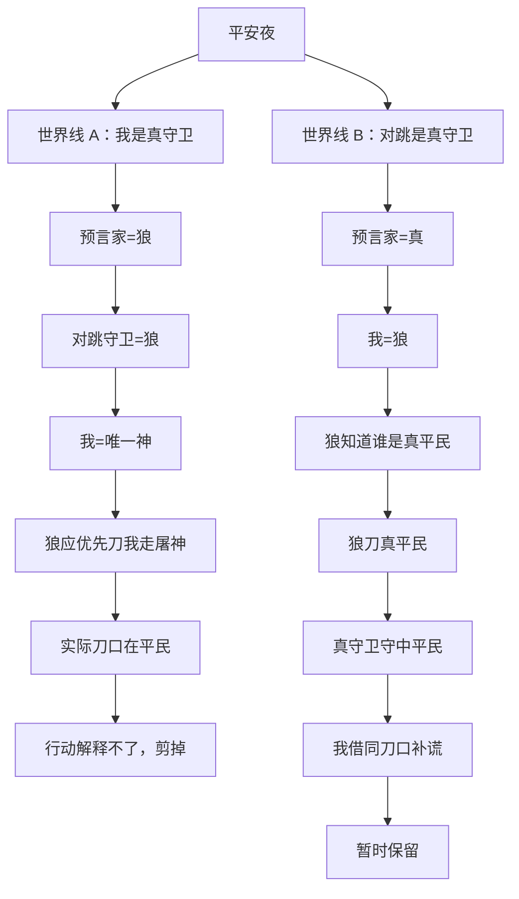
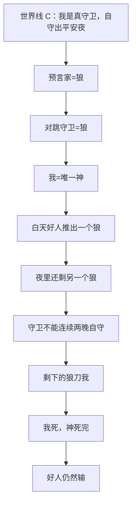

# 世界是如何死去的

*从一局狼人杀整理不完整信息下的推理过程。*

有一局狼人杀，我赢了。

但复盘的时候，我发现自己赢的那条世界线，其实有一个很明显的漏洞。

更有意思的是，场上没有人发现。

这件事后来一直留在我脑子里。

一开始，我以为它只是一个狼人杀里的小技巧。

后来我才意识到，它更像一个小型推理系统。

它让我开始看见，在不完整信息下，人是如何构造世界、传播约束、剪掉世界，又在剪不掉的时候主动制造信息的。

## 那一局游戏

那一局里，我是狼。

我一直在跳守卫。

为了方便说明，我们先站到上帝视角。

场上还有一个真守卫，一个真预言家，一个真平民，以及我的狼队友。我的狼队友当时伪装成了平民。

按正常节奏，预言家迟早会在我和另一个对跳守卫的人之间确认一个。

所以在局势彻底锁死之前，我先把故事打出去。

我说，真预言家和真守卫，其实是双狼。

结果当天预言家真的查杀了我。

从局部看，这个故事是可以讲的。

如果我是守卫，那么另一个对跳守卫的人就是狼。

如果预言家查杀我，那么预言家也可以是狼。

于是，我可以把他们打成双狼。

后来夜里，我们狼队没有刀我，而是去刀了那个真平民。

结果出了平安夜。

第二天，我和真守卫报出了同一个刀口。

这一步真正确认的，不是谁是真守卫。

而是昨天晚上，狼确实刀了这个平民。

于是，平安夜有了一个看起来很合理的解释。

如果我是守卫，平民没死，是因为我守中了他。

故事在那一刻看起来闭合了。

但这张棋盘在狼眼里和好人眼里并不一样。

同一局游戏，不同玩家其实生活在不同的世界里。

最后，我赢了。

但复盘的时候，我突然意识到，这个故事其实没有闭合。

那天晚上，我们之所以刀那个平民，是因为狼队知道，他是场上唯一还活着的平民。

另一个看起来像平民的人，其实是我的狼队友。

也就是说，在好人阵营眼里，如果我真的是守卫，那么我就是场上唯一还活着的神。

平民却还有两个。

狼人只要刀掉我，就可以直接走屠神路线。

可他们没有。

他们去刀了那个平民。

如果我是守卫，那么狼队那天晚上的行动，就解释不了了。

## 先不要急着判断身份

这也是我后来觉得有意思的地方。

当时场上看起来是在讨论身份。

谁是真的守卫？

谁是真的预言家？

谁是狼？

但复盘的时候，我越来越觉得，这些问题只是入口。

真正要比较的，不是一个人的身份标签。

而是不同身份假设背后的整个世界。

先把那一局拆成两条最关键的世界线。

如果我是真守卫，那么给我发查杀的预言家就是狼，另一个对跳守卫的人也是狼。

这条世界线里，我是唯一神。

场上还有两个平民。

那么好人要继续问：狼为什么不刀我？

如果狼真的已经看见了唯一神，为什么要去刀一个平民？

这条世界线可以解释平安夜。

但它解释不了刀口。

另一条世界线是，对跳的人是真守卫，预言家是真的，我是狼。

这条世界线里，夜里的刀口就更容易解释。

狼队知道真正的平民是谁，所以去刀那个平民。

真守卫守中了他，所以平安夜成立。

我第二天也报了同一个刀口。

这时，同一个平安夜，在两条世界线里的意义完全不同。

如果我是真守卫，它看起来像是我身份的证据。

如果我是狼，它只是我借来补全谎言的一块拼图。

所以真正需要比较的，不是我说得像不像守卫。

而是哪一条世界线，能够同时解释查验、对跳、刀口、轮次和每个人的收益。

## 一个世界不一定死在现在

有些世界线不是因为眼前矛盾才死掉。

它们是因为往后推一步，已经没有赢法。

比如，平安夜之后，我也可以尝试制造另一条世界线。

我可以说，我是真守卫，昨晚自守，所以出了平安夜。

这条世界线在当前这一刻也能解释结果。

如果狼刀我，我自守，于是平安夜。

但问题在于，守卫不能连续两晚自守。

把它往后推一步，就会变成这样：

如果好人相信我是唯一神，那么即使白天把他们视角里的一个狼推出去，比如推出预言家或者对跳守卫，夜里剩下的另一个狼仍然可以来刀我。

我不能连续自守。

我一死，神就死完。

好人还是输。

也就是说，如果好人想赢，他们不能按“我是真守卫”这条世界线玩。

这条世界线不是不能解释现在。

它是解释不了未来。

这也是我后来越来越重视轮次的原因。

有些世界看起来没有违反眼前事实，但它们一旦往后模拟，就已经死了。

## 有些世界死在收益上

还有一些世界，不是规则不允许，而是收益不允许。

比如，真实游戏里平民当然可能跳神。

有时候，平民跳神是为了帮真神挡刀。

在前期，这可能是合理的。

但在我那一局的残局里，这条分支基本不该考虑。

因为局势已经快结束了。

这时候平民再穿神的衣服，不是在保护真神，而是在污染身份池。

它只会把真神推入狼坑。

所以，平民跳守卫这件事，在规则上可能存在。

但在那个具体局势里，收益不成立。

这条世界线也可以被提前剪掉。

这让我意识到，推理不是只看“有没有可能”。

还要看，在当前局势下，这样做有没有收益。

一个行动如果对该身份没有收益，它就不能轻易被当作正常行为解释。

## 世界为什么会死

后来我开始把这种推理拆开看。

我发现，一条世界线会有很多种死法。

有些世界死在规则上。

例如，守卫只能有一个。

如果一条世界线需要两个真守卫，它直接死掉。

有些世界死在观测上。

例如，一个人的发言、投票、查验、刀口和之前的身份假设冲突。

新的信息一进来，某些世界就不再能解释现实。

有些世界死在行动上。

例如，如果我是唯一神，狼却没有刀我。

这不是规则矛盾。

但它让狼队行动无法被解释。

有些世界死在收益上。

例如，残局里平民跳神，把真神推入狼坑。

这不是不可能。

但它不像一个合理身份会选择的行动。

有些世界死在未来上。

例如，我是真守卫这条世界线，即使当前能解释平安夜，往后一轮模拟，好人仍然没有赢面。

这种世界不需要等到未来真的发生。

它可以现在就被剪掉。

这可能是我研究狼人杀这么久后，最想系统整理的一点。

推理不是简单地判断一个故事能不能解释当前事实。

推理更像是不断问：这条世界线还能活多久？

它能不能解释规则？

能不能解释观测？

能不能解释行动？

能不能解释收益？

能不能解释未来？

每多过一层约束，它就多活一轮。

过不去，就死掉。

## 剪不掉的时候怎么办

当然，真实游戏不会总是这么干净。

很多时候，会有好几条世界线都还活着。

它们都能解释当前信息。

它们都没有立刻违反规则。

它们也都能讲出自己的收益逻辑。

这时候，继续在脑子里想，不一定有用。

局势需要被往前推。

所以有些玩家会打平衡。

会安排放逐 PK。

会故意去压一个人，看谁来救。

会把焦点打到某个玩家身上，看他自己的反应，也看其他人的投票和站边。

这些行为表面上像是在攻击某个人。

但它们有时候真正的目的不是立刻推出谁。

而是制造信息。

如果 A 是狼，别人会怎么救他？

如果 A 是好人，狼会不会趁机冲票？

如果某个人一直说自己站边 A，可到了投票时突然犹豫，这个犹豫又说明什么？

当世界线剪不下去时，就需要制造一个局面，让不同世界线表现出不同反应。

这也是我后来觉得很有意思的地方。

推理并不总是被动等待信息。

有时候，推理会主动制造信息。

## 我后来发现自己在做什么

以前我以为，狼人杀是在判断谁是狼。

后来我发现，我真正做的事情更像这样。

先根据已有信息构造多个可能世界。

然后把规则放进去。

把身份池放进去。

把刀口放进去。

把收益放进去。

把轮次放进去。

把未来往后推一两步。

有些世界立刻死掉。

有些世界暂时活着。

如果还剩多个世界，就继续观察。

如果观察不够，就主动制造新的局面，让世界线分叉。

然后继续剪枝。

这听起来像算法。

但它其实也是很多人在游戏里自然会做的事情，只是没有把它拆出来。

狼人杀真正吸引我的，可能也正在这里。

它把不完整信息下的推理过程压缩进了一局游戏里。

身份是隐藏的。

动机是隐藏的。

收益是隐藏的。

信息结构也是隐藏的。

你看到的只是发言、投票、刀口和结果。

然后你要在这些碎片后面，不断构造、检验、模拟，并淘汰那些已经无法成立的世界。

## 之后还可以继续往下走

这一篇其实还没有讨论更复杂的板子。

例如大小狼不见面。

例如隐狼。

例如假面舞会。

到了这些板子里，问题会再复杂一层。

因为隐藏的不只是身份。

还有信息结构本身。

有些人并不知道自己的队友。

有些人拿到的信息可能是错的。

有些观测结果本身可能被机制污染。

那时要推的，就不只是哪个世界成立。

还包括：我看到的信息，究竟来自一个什么样的信息系统？

这可能是下一篇该继续整理的东西。

这一篇先停在这里。

我现在想记录的，是最基础的一层。

一局狼人杀里，世界是如何被建立的。

约束是如何被传播的。

世界又是如何一个个死去的。

那局游戏，我赢了。

但真正留下来的不是那场胜利。

而是那个后来一直没有离开我的问题。

为什么一个看起来合理的故事，最后却解释不了整个世界？
