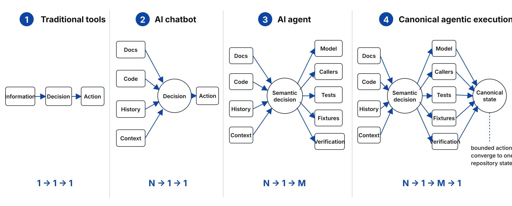

# Coding Agents Should Transform Pipelines, Not Accumulate Patches

*A proposal for bounded pipeline transformations as the unit of agentic software change*

*Originally written in July 2026 and lightly edited for publication on September 17, 2026.*



Every committed code change replaces one repository state with another.

That sounds obvious, but most coding tasks are still phrased as additions:

- add a model;
- add a field;
- add support for a new case;
- add an adapter;
- add a fallback.

This made sense when execution was expensive. Humans often had to move through a migration one file, one caller, and one pull request at a time.

Coding agents change that cost structure.

AI chatbots make information gathering many-to-one: documentation, code, history, and context can be compressed into one decision.

Coding agents make execution one-to-many: one natural-language decision can update models, callers, tests, fixtures, and runtime paths across a codebase.

```text
Traditional tools:  1 → 1 → 1
AI chatbots:        N → 1 → 1
AI agents:          N → 1 → M
```

The useful end state is:

```text
N information sources
→ 1 semantic decision
→ M coordinated changes
→ 1 coherent repository state
```

The important engineering question is therefore not only how to make agents act faster.

It is how to define a change so that the agent can propagate it through the right scope and leave the repository in one coherent state.

## The unit of change should be a bounded pipeline transformation

The central idea is simple:

> Treat a code change as a transformation of the affected pipeline, not as a new path added beside the old one.

A pipeline here does not mean the entire system.

It means any bounded responsibility flow with an input, an output, and a coherent internal contract.

It may be large:

```text
request
→ normalization
→ domain decision
→ persistence
```

Or it may be small:

```text
caller
→ calculate(price)
→ result
```

Adding one variable can still be a pipeline transformation.

Before:

```text
caller
→ calculate(price)
→ result
```

After:

```text
caller
→ calculate(price, currency)
→ result
```

The physical change may be tiny. But the affected contract has changed.

The transformation is incomplete if some internal callers still use `calculate(price)`, others use `calculate(price, currency)`, and a fallback silently guesses the missing currency.

The point is not that every change must delete a large amount of code.

The point is that the affected path should move from one coherent state to its next coherent state.

## “Replace” describes the state transition, not the amount of deletion

This is where the idea can be misunderstood.

“Transform rather than add” does not mean that every task is a refactor, or that every change must remove a class or rewrite an architecture.

A new feature can transform an existing pipeline.

A bug fix can replace an incorrect decision rule with a correct one.

A new parameter can replace an old function contract with a new one.

A dependency upgrade can replace one implementation path with another.

An architectural migration can move authority from one component to another.

In every case, the repository moves from state A to state B.

```text
Current canonical sub-pipeline
→ bounded transformation
→ next canonical sub-pipeline
```

The change may add code. But the result should not be an unclassified parallel reality.

## The transformation contract is the control point

The control point between intent and execution should not be a detailed file-by-file plan.

That would waste the agent's ability to discover references and perform mechanical work.

Instead, the transformation contract should define the semantic change:

```text
What part of the pipeline is changing?
What is its current contract?
What is the target contract?
Which invariants must hold afterward?
Where does the transformation stop?
What remaining uncertainty is outside the verified boundary?
```

The contract does not need to enumerate every file or affected symbol in advance. The agent can discover the concrete implementation surface from the repository; what should remain stable is the target state, propagation boundary, and completion criteria.

For example, this is too weak:

> Add currency support to price calculation.

This is a transformation-oriented decision:

> Within the pricing sub-pipeline, make currency an explicit required input to price calculation. Migrate every internal producer and consumer in scope. Do not preserve an internal fallback that infers currency. Stop at the public API boundary.

The second version does not prescribe files.

It defines the old state, the new state, the propagation surface, and the stopping boundary.

That is enough for the agent to fan out into coordinated actions.

## Why capability specifications are not enough on their own

A normal feature specification usually describes capability:

> What should the system be able to do?

For example:

- support multiple currencies;
- accept a new field;
- expose a new endpoint;
- preserve existing behavior;
- pass the test suite.

An agent can satisfy all of those requirements while leaving multiple internal contracts active.

This creates a distinction:

```text
Capability specification
= what must become possible

Transformation contract
= how the affected path must change
  and what internal state is allowed to remain
```

This is not an argument against capability specifications. They should remain the source of what the system must become able to do.

The problem is that capability intent alone is often additive by default. It says what to introduce, but not what existing contract is being replaced, which callers must move, where compatibility is allowed, or what must no longer remain active.

For agent-executed work, capability intent should therefore be paired—after the current repository state is understood—with a transformation contract for the affected path:

```text
current sub-pipeline
→ target sub-pipeline
```

Together, they should define both:

```text
what becomes possible
+
what becomes canonical
```

## Why this comes before loop engineering

Loop engineering focuses on how an agent continues working:

```text
observe
→ plan
→ act
→ test
→ inspect
→ retry
```

That is the execution mechanism.

But a loop does not decide which repository state should survive.

If the target is only:

```text
the feature exists
and the tests pass
```

then a capable loop may add adapters, optional parameters, converters, fallbacks, and compatibility branches until the tests are green.

The loop succeeds at execution while the pipeline accumulates competing paths.

The correct order is:

```text
bounded transformation
→ target state and invariants
→ agent loop
→ coordinated execution
→ verified resulting state
```

Loop engineering answers:

> How does the agent keep making progress?

The transformation contract answers:

> What change is the loop performing, and what resulting state counts as complete?

The loop is downstream of the transformation contract.

## Subagents divide execution, not semantic authority

This model does not reject subagents.

Several agents may work inside the same transformation:

```text
Shared transformation contract
├── dependency discovery
├── implementation
├── test migration
└── residual-path verification
```

But they should not independently decide which contract, writer, or path is canonical.

Otherwise one agent adds the new contract, another preserves the old one for tests, another introduces a converter, and another adds a fallback.

Each subtask can look successful while the resulting pipeline becomes less coherent.

> Execution may be distributed. The state transition must remain unified.

## Git already provides the isolation boundary

Git branches and pull requests fit this model naturally:

```text
Branch
= isolated candidate repository state

Pull request
= proposed bounded transformation

Review
= verify the target path, migration surface, and remaining uncertainty

Merge
= accept the new repository state as canonical
```

A pull request does not need to complete the entire system pipeline.

It can transform one sub-pipeline.

But within that declared boundary, it should leave one coherent resulting path.

This changes how PR atomicity is understood.

A PR is not necessarily atomic because it changes few files.

It is atomic when it performs one bounded semantic transformation.

```text
Small semantic surface
Complete affected surface
```

A twenty-file PR can be semantically atomic.

A two-file PR can create two competing truths.

## Compatibility is a classified boundary, not an accidental second architecture

Some changes genuinely require temporary or permanent alternate paths:

- database migrations;
- public API compatibility;
- external plugins;
- rolling deployments;
- experiments;
- operational rollback.

The goal is not to ban them.

The goal is to classify them.

A remaining alternate path should have an explicit role:

```text
canonical
compatibility
migration
experiment
rollback
projection
```

It should also be clear which path owns authority and where the compatibility boundary ends.

“Two paths exist” is not automatically a failure.

“Two paths exist and both look equally canonical” is the failure.

A useful rule is:

> Explore broadly. Commit one coherent state.

## A prompt to try

For any code change whose target state is sufficiently understood, try adding this to the coding-agent instructions:

```text
Treat this task as a bounded transformation of the affected pipeline, not an addition beside it.

Within the declared scope, propagate the change through every affected producer and consumer and leave one coherent internal path. Any remaining alternate path must be explicitly classified as compatibility, migration, experiment, rollback, or projection.

Do not claim completion beyond the verified boundary.
```

A shorter version is:

```text
Transform the affected path; do not create a parallel one. Migrate all affected producers and consumers, and leave one coherent internal path within the declared scope.
```

This applies whether the task replaces an architecture, fixes an algorithm, adds a feature, or introduces one variable.

## A research hypothesis

This is still a hypothesis.

The claim is not that larger diffs are always better, or that every migration should happen in one PR.

The claim is:

> Coding agents make it practical to organize software work around bounded state transitions rather than additive local patches.

A useful experiment could compare:

1. a standard feature-oriented prompt;
2. task or subagent decomposition;
3. a bounded pipeline-transformation prompt.

Possible measures include:

- functional correctness;
- number of active internal paths;
- undocumented fallbacks;
- duplicate authority;
- legacy-contract residue;
- review time;
- follow-up repair cost;
- token and execution cost.

The most important question is not whether the agent changes more files.

It is whether the repository ends in a more coherent state.

Coding agents give us a new execution shape:

```text
many inputs
→ one semantic decision
→ many coordinated changes
```

The engineering discipline should complete that shape:

```text
many inputs
→ one bounded transformation
→ many coordinated changes
→ one coherent repository state
```

That may be a better unit of agentic programming than the patch, the file, or the task.

---

*I’m continuing to explore the broader question behind this essay—how repositories and engineering workflows should change when coding agents become primary operators—in [RepoDelta](https://github.com/repodelta/repodelta).*
