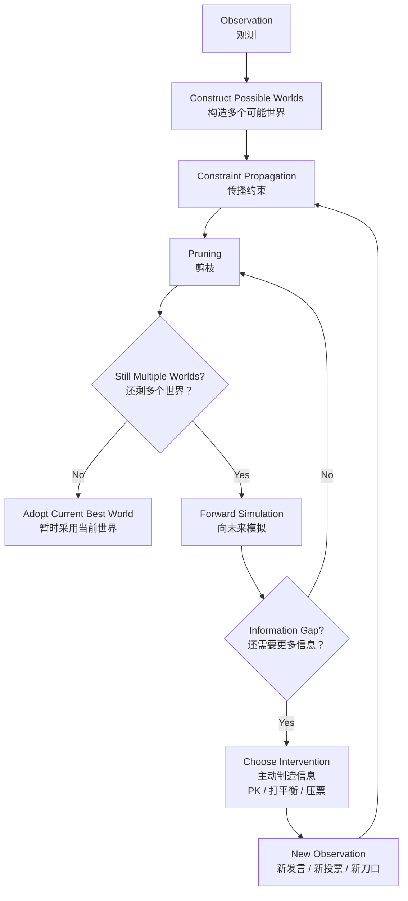

# Reasoning Loop v1

This is the earlier, more detailed research version of the reasoning loop. It is not currently used in the article. It is kept as a working model for future notes on possible worlds, pruning, simulation, and intervention.



## Notes

Core loop:

```text
Observation
  → Construct Worlds
  → Constraint Propagation
  → Pruning
  → Simulation
  → Intervention
  → New Observation
  → Constraint Propagation
```

This version is useful for internal reasoning because it preserves the decision points that the reader-facing diagram compresses away.
